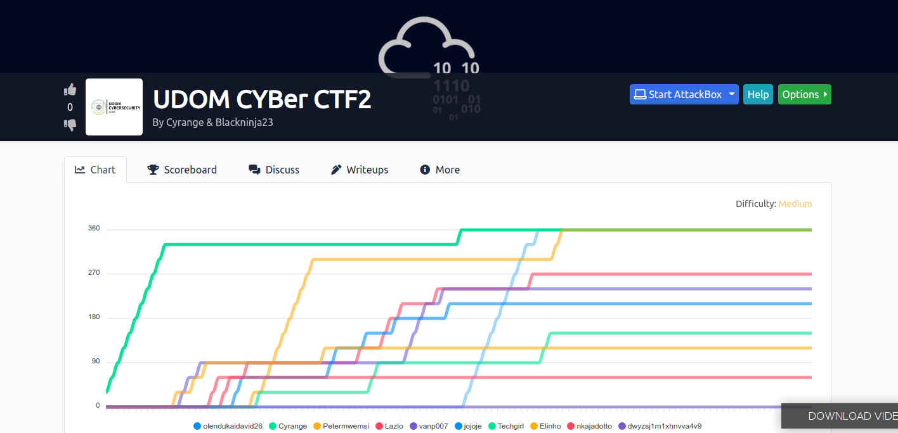
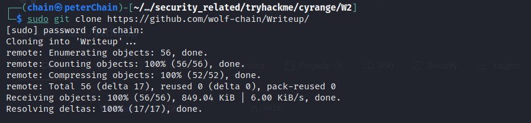

# UDOM CYBer CTF2:
 
 ## How to get the files containing writeups
 here is how you can download all files ones and read one by one. Just run in your terminal as seen in the image below  you will have a folder named writeup...Then open it and read one by one according to question number.
    
    
    sudo git clone https://github.com/wolf-chain/Writeup/
    
  ### for any comments or addtion or any issue contact me through
  
  email: julietgroup1@gmail.com  
  twiter: https://www.twitter.com/peterChain7  
         written by peterChain7
 
